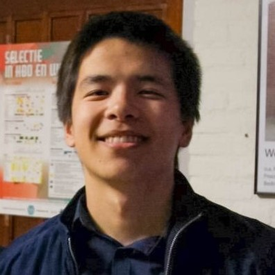

# GoGreen group 46
WIP page

## Our group
### Momchil Bozhkov
**Name:** Momchil<br>
**NetId:** mbozhkov


#### Personal Development Plan

2 Strong points:
- Determination. Having the inner courage to do everything, that needs to be done in order to achieve the goal that i have put in front of myself. Forcing myself to do the things i need to do, even when i dont feel like it, is something which makes me treat myself to a higher standard and also makes me enjoy the sweet fruit of reward much more when said goal has been achieved and achieved with high remarks.
- Good spirit and being nice in general. Being able to make a certain situation less intimidating for a single person or a group of people is very important to me so i give it my all when somebody is strugling or is in need of some sort of help. If someone is having a bad day and you make them smile for just 10 seconds that person would be gratefull to you for the rest of the day. So having the abillity to help out my teammates whether its when we are stuck on a certain problem or just make everyone smile and be motivated so that they can do their best work is something i aspire to.
 
2 Weaker points:
- Procrastination and laziness. I have been strugling with these two since i was a small child but i try my best every single day to just make them dissapear little by little so that it dosen't affect my work and the essentials of what i have to do to achieve.
- Not a lot of experience with CS in general. I am a medium pace learner of sorts and Computer Science has a lot of things that need to be inherited at a quick pace so i find myself sometimes strugling to stay a float.

My goals:

1. Experience what it's like to work in a real Software Team enviroment so that i could more easily get acquainted with the way work is done in this whole industry for later down the road.
2. Get to grip with software and programing on a more in-depth scale and see what areas of my CS skills i need to work on so that i can contribute more effectively to my team now and later on when working for an actual Software company.

<br>

### Stephen
**Name:** Stephen van der Kruk<br>
**NetID:** svanderkruk



#### Personal Development Plan

2 Strong points:
- Perseverance. I don’t like when I dash off my work. So really try my hardest to know as much as I can. This is because I think that you need a good foundation of previous material before you start branching off into material which depends on that knowledge. This point is shown in the team in that I really try to finish my part of the work. I think peer pressure is a good thing in this case since I don’t want to let my team down by giving up on my work.
- Organized. I want a clear definition of what I’m doing before I start. This way I reduce the chance of digression from what must be done. In the team I think this help with knowing what we are all up to instead of digressing too much.

2 Weaker points
- Time Management. Trying to work out all the details takes a lot of time and taking the time to sort all the work doesn’t help either. I think in a group this isn’t really a problem since I really get that extra bit of motivation from working with a team to do the work immediately.
- Control freak. I don’t like it when I don’t know what something (or somebody) is doing. This sounds bad, but from previous experience from working in teams I have learned from my mistakes. Everybody knows what they are doing, so why do I feel the need to take over? That is what I ask myself. So, I’ll try to use the good parts of being a control freak, that is, being in control of what I’m doing instead of someone else is doing.

Quality 1: Perseverance -> Pitfall: Bad time management -> Challenge: Prioritize your work -> Allergy: Dashing off

Quality 2: Organized -> Pitfall: Control Freak -> Challenge: Focus only on my work -> Allergy: Disorganized

My goals
1. I want to extend my knowledge on programming. This is of obviously important since there is a lot to learn. I achieved this, when I have a good understanding of how all parts of our program work in coherence with each other. To achieve this, I will be learning through collaboration with my team, documentation and other learning material. I hope to learn from mistakes. I think testing is an important tool to understand your mistakes. I think the best thing to do now is to design and program the things that are on the planning and keep doing that throughout the project.
2. This is the more important goal in my opinion. I want to gain more experience on working in a team and learn how to be a meaningful addition to the team. This is very important to me since (software) engineering is nowadays all about collaborating. I achieved this when I have reflected and learned from the feedback of my team. So, this depends on what my team will think of my actions during the project. Whether good or bad, I hope to learn from it to do even better next time. To actively be working on learning from my actions I can ask my teammates for their opinions and feedback. That can be done by e.g. asking about the usefulness of my action.

<br>

### Mirijam
**Name:** Mirijam Zhang<br>
**NetID:** sxzhang


#### Personal Development Plan

Two of my strong points:
- Commitment, I work seriously on my tasks and always try my best.
- Supportive, I'm always willing to help my teammates with their tasks or explain things they don't understand to them.

Two of my weaker points:
- Lazy, I am quite lazy, so I usually prefer people telling me what to do (preferably the easy tasks). In a team I usually do what I am told to do without thinking about it. This ends up in me not understanding my tasks and not doing a good job.
- Perfectionist, when I do get what's going on I feel like I need to make everything look perfect and that can lead to me pushing my way of doing it onto other people. 

Core quadrants:

Commitment -> pitfall: bad time management -> challenge: don't focus too much on one thing -> allergy: slacking off

Supportive -> pitfall: annoying -> challenge: don't do more than you've been asked to -> allergy: nonchalant

My goals:
1. I want to know how to work together on a project. This is important to me since I know that in the future, building anything will be done in a team, so it's important to learn how to work together without conflict. I will listen to the thoughts of my teammates, help them if they need help, let them help me if I need help and try to actively think of ways to improve our program and myself.
2. I want to know more about programming. This is obviously important since I study CSE. I want to know more about the different aspects of the code that builds the program, like the database and the UI. I will do this by understanding what my teammates coded and not work on one thing.

<br>

### Qingna Zheng
**Name:** Qingna Zheng<br>
**NetID:** qingnazheng


#### Personal Development Plan

**_Two of my stronger points:_**
* **Supportive.**<br> I will try my best to help my teammates understand things they do not know if possible.
* **Self-discipline.**<br> I will force myself to finish the task before the deadline.

<br>**_Two of my weaker points:_**
* **Not good at communicating.**<br> I would not say I like to talk in the team since my English is quite bad compared to others, and I am afraid that someone will laugh at me even though I know they won’t. 
* **Lazy.**<br> I usually do the task which is asked to do; I would not say I like to do more things that are not in my range.<br>

<br>**_Core quadrants:_**<br><br>
**Quality:** *Supportive* -> **Pitfall:** *Spending too much time helping the others* -> **Challenge:** *Concentrate on your own job* -> **Allergy:** *Less supportive*<br><br>
**Quality:** *Self-discipline* -> **Pitfall:** *Overly disciplined* -> **Challenge:** *Be more flexible* -> **Allergy:** *Lacking self-control*<br>

<br>**_My goals:_**
1. **Improving my English.**<br> This is important to me since I need to communicate during the project with my teammates. To achieve it, I need to learn several new English words every day and interact with my teammates as much as possible.<br>
2. **Improving my programming skills**<br> I would like to do this as I have almost no experience with Computer Science at all and I find it is quite difficult for me to learn this course. During this course, I can practice with my teammates. As I exercise more, I can learn more stuff in it.

<br>

### Tim
**Name:** Tim Anema<br>
**NetID:** tpdanema 


#### Personal development plan
**_Two of my stronger points:_**
* **Organized.**<br> I'm not one to start something and 'see what happens', when I start with something I usually try to plan everything out beforehand. 
For programs like this I like to make simple drawing of most models and how they interact with each other, effectively making the whole scheme on paper first. 
This might sound inefficient, but I've come to realize this strategy is usually faster in the long run.<br>
 I suppose this will help the team by preventing us from developing things needlessly.
* **Eager to learn.**<br> I don't mind spending extra time outside of school to get a better understanding of something.
This something can be a (programming) language, framework or something else entirely.<br>
This should be useful in a team project because I'm always willing to spend extra time understanding something to explain it later to teammates who do not yet fully understand something or require help.

<br>**_Two of my weaker points:_**
* **Control freak.**<br>
The reason why I sometimes prefer working alone is because I'm in control. 
I try to control a lot of things, and want to know what everybody is doing. 
At first I always felt this was a good thing, at least someone was in control. 
But as I did more group projects in highschool, it became apparent this characteristic was not very useful and more often than not caused a conflict with other 'control freaks'. <br>
In a team I might look bossy or a know-it-all.
* **Difficulty with pacing myself.**<br>
This is the one thing that I really struggle with in group assignments, especially when I like the project. 
When starting an assignment/project, more often than not I just want to sit down and complete it as fast as I can. 
Sometimes this is appreciated (mostly by groupmates who do not feel like doing much), but I suppose this might also be annoying for students who actually want to work on a project. 
It's also not like I don't feel like explaining things, it's the opposite actually.
I really like to explain stuff, but I also regularly forget people may just have started with programming/working with X, which sometimes causes them to be more confused after my 'explanation'.

<br>**_Core quadrants:_**<br>
*Organized* -> **Pitfall**: *Overly organized* -> **Challenge:** *Leave thing as they are* -> **Allergy:** *Disorganized*<br>
*Eager to learn* -> **Pitfall**: *Spending to much time on the project* -> **Challenge:** *Stop always trying to understand everything* -> **Allergy:** *Brainless copy-pasting*

<br>**_My goals:_**
1. **I want to expand my knowledge of the Spring framework, and RESTful APIs.**<br>
This is important to me because I personally really like working on the backend-side of projects, but I've never actually made a medium-big RESTful API from 'scratch' (quotation marks because of frameworks) in a team. 
I'm actively working on this goal, by creating a RESTful API with Spring in a team.<br>
We haven't really started development at the time of writing this plan, but at the moment I've managed to learn more about efficiently loading entity relations with JDA and Hibernate.<br>
I assume the best way to achieve this goal is by just doing it and having an active role in developing our backend. 
Another option is by making an extra API to give our project the most accurate CO2 values. 
However, my best option is by far the first one, since that will take the most effort. 
I will start on achieving this goal as soon as we start programming. At the moment I can just learn and practice.
2. **My second goal is to be more effective in working with a team.**<br>
I think this is something I definitely should work on because it is something that will be relevent my entire career (and probably even my entire life). 
Besides the obvious reason, I also think this is something I should work on for the sake of my future teammates.<br>
As I hinted in the previous sentence, teamwork is not really my strong suit.
I think the fact that I'm willing to explain is already a good thing, but my stubborness to sometimes not accept other people's insights might negate this.<br>
To help achieve this goal I should probably be more accepting of other people's ideas, and help them. 

<br>

### Daniela
**Name:** Daniela Toader <br>
**NetID:** dtoader


#### Personal Development Plan

**_Two of my stronger points:_**
* **Communicative.**<br>It is shown through the favorable way of interacting with the teammates. I always like to begin with knowing a few details about each member of the group before starting the actual work. Also, I am very happy when we have discussions related to the steps we should follow in order to get to the final form of our assignment. I think this is undoubtedly important because it helps everyone know how the project flows.
* **Dedicated.**<br>This can be observed through the valuable quality of the end products I create for the projects I work on. I tend to work extra if it is required in order to achieve some of the best results as I appreciate good quality work. I also try to help the people around me if it happens for me to know more so we can all successfully complete everything we come up with.

**_Two of my weaker points:_**
* **Stressed.**<br>One of my weaker points is stressing more than it would be necessary in the process of doing assignments. It might be shown in a team by my attempts to solve as many things as possible in a short period of time.
* **Unexperienced.**<br>Not knowing extra information related to programming that could be useful in these kinds of tasks might drag me down a little, which could mean spending more time on descovering how things actually work instead of immediately doing them. This can also appear as a tendency to accomplish the tasks that have been assigned to me more than taking initiative.<br>

<br>**_Core quadrants:_**<br><br>
**Quality:** *Communicative* -> **Pitfall:** *Deviating from the subject* -> **Challenge:** *Concentrate on doing rather than expressing* -> **Allergy:** *Communicating less*<br><br>
**Quality:** *Dedicated* -> **Pitfall:** *Exhaustion* -> **Challenge:** *Do less things* -> **Allergy:** *Lacking dedication*<br>

<br>**_My goals:_**
1. **Developing better teamwork abilities as well as gaining more experience with splitting the tasks.**<br> 
I consider these ideas to be extremely important since the IT world requires you to have social skills. Moreover, this kind of environment also involves dividing big assignments into many small branches distributed among the entire team. I am actively working on my goal as I’m trying to establish strong connections throughout the team and I will also do my best to make sure everyone has his/her own important part in this process. I consider I have plenty of options regarding this topic, thanks to my positive attitude, desire to work together with the others and to my colleagues’ receptiveness.<br>
2. **Improving my programming knowledge.**<br>
This is an essential part in the process of becoming a computer scientist as it is what all is based on. I am actively working on this goal by trying to absorb as much information as I can from each experience I get involved in and by doing research. There are many options to choose from when talking about learning how to properly do programming and the one I will use most is actually this project during which I’ll get an actual perspective on the idea of being a programmer.


<br>

### Shah Farooq
**Name:** Shah Farooq<br>
**NetID:** sfarooq


#### Personal Development Plan

**_Two of my stronger points:_**


* **Experience**<br> Work Experience in a start-up with tasks consisting of web-based development on Node, Angular & React, Git therefore I’m aware of what it’s like to be in a professional environment.

* **Positive attitude & commitment** <br>To go above and beyond my assigned tasks by helping and learning from others when we’re stuck and see things through to the end. 


**_Two of my weaker points:_**

* **Staying Calm**<br> The project is exciting, however, intimidating because I have to grasp new frameworks like Spring,Maven,JavaFX, numerous other libraries and learning their functionalities and their effective usage scenarios. Therefore, it is a substantial part of my learning goal during this course to know how to produce large-scale projects.   

* **Procrastination**<br> It comes naturally. For me, personally, this how I produce my best output by procrastinating - maybe it’s the adrenaline rush of the thrill of working close to deadlines.

<br>**_Core quadrants:_**<br>

**Quality:** *Experience* -> **Pitfall:** *May seem like a know-it-all* -> **Challenge:** *Share productive techniques for project success* -> **Allergy:** *Enforcing bad practices*<br>

**Quality:** *Optimism* -> **Pitfall:** *positive but unproductive* -> **Challenge:** *Timely Done Tasks* -> **Allergy:** *Pessimism*<br>


<br>**_My goals:_**

1. **Improve problem-solving and critical thinking skills to come up with creative solutions by making judgment calls and trade-off analysis.**<br>
Problem-solving skills are essential for programmers in the 21st century and we have numerous resources and tools at our disposal to take advantage of such as Google, StackOverflow, Books and of course team members past experiences.  With my teammates we can: brainstorm, get new ideas and creative juices flowing and think in different perspectives. 

2. **Having professional, friendly and open team communication to clearly get ideas across the group and be open to constructive criticism.**<br>
Since the project is more about software engineering methods than programming, communication is key so it’s a good idea to learn about modern development processes like agile and software-development life cycles. Efficient time-management – prioritise tasks in an effective workflow environment using scrum methods.

## How To Use

To clone and run this application, you'll need [Git](https://git-scm.com) and [Java](https://www.oracle.com/technetwork/java/javase/downloads/index.html) installed on your computer. From your command line:

```bash
# Clone this repository
$ git clone https://gitlab.ewi.tudelft.nl/cse1105/2018-2019/oopp-group-46/template.git

# Go into directory
$ cd template

# Build project (Windows CMD)
$ mvnw clean install

# Build project (Unix terminal / Git Bash)
$ ./mvnw clean install

# Run the server
$ java -jar server/target/Server.jar

# Run the client
$ java -jar client/target/Client.jar
```

### Git basics
Quick disclaimer: I've left out a lot of things, and this is just a short summary with some example. 
If you want to know more, there are some quality links on Brightspace. I also can recommend [this website](https://learngitbranching.js.org/), because they visualize git which can be helpful.<br>
You will probably need the next few commands a lot, so here's a short summary of useful commands dealing with changes:
```bash
# Stage changes 
$ git add fileName

# View status of 'staging area'
$ git status

# Unstage changes
$ git reset fileName

# Commit changes
$ git commit -am "Commit message"

# Push changes
$ git push origin branchName

# Stash changes
$ git stash

# Apply changes
$ git stash pop

```

#### Branches
The next few commands are a little bit more advanced, but important nevertheless. You use these commands to work with branches
```bash
# Get all branches (active branch will have a * prefix)
$ git branch

# Create a new branch
$ git branch branchName

# Switch to branch
$ git checkout branchName

# Create a new branch from 'dev' branch and switch to it
$ git checkout -b branchName dev

# Update branch
$ git pull origin branchName

# Merge other branch into current branch
$ git merge otherBranch

# Delete branch (use -D to force delete it)
$ git branch -d branchName

```

#### Examples
All the commands above are useful, but useless if you don't know how to combine them. I will show a few examples in this section.
```bash
# Lets say you want to create a new branch 'feature/print-leaderbord-button'
# and merge it into 'dev' when you are done

# First you have to create and checkout the branch which is based on the latest dev branch
$ git checkout -b feature/print-leaderbord-button dev

# After you did some work you add and commit your work
$ git add .
$ git commit -am "Finished the button"

# This will result in something along the lines of this
[feature/print-leaderbord-button 36b9621] Finish the button
 1 file changed, 1 insertion(+)
 create mode 100644 BUTTON_FILE.md
 
# Now your feature is done, and you want to merge it into the dev branch
# However, it might be someone else already merged their feature into dev
# That's why you first have to update your branch, to start first switch to dev and update it
$ git checkout dev
$ git pull origin dev 

# This pull can result in three different scenarios. 
# 1) No updates, your branch is up-to-date
# 2) Updates, but no merge conflicts. Git can fix this on its own
# 3) Merge conflict, you first have to fix the conflict before you can update
# For now assume there were no updates (see 'Fixing merge conflicts' if you want to see the third scenario)

# After your pull, you should see something like this (scenario 1)
From https://gitlab.com/timanema/xxx
 * branch            dev        -> FETCH_HEAD
Already up to date.

# You can now merge dev into your feature branch
$ git checkout feature/print-leaderbord-button
$ git merge dev

# This will result in something like this (still scenario 1)
Switched to branch 'feature/print-leaderbord-button'
Already up to date.

# Now your branch is ready to be merged
# You do this by opening a merge request on gitlab

# After you merged the branch you should do some local cleanup
# First switch to dev and fetch the updates
$ git checkout dev
$ git fetch -p

# You should see something like this
From https://gitlab.com/timanema/xxx
 - [deleted]         (none)     -> origin/feature/print-leaderbord-button
remote: Enumerating objects: 1, done.
remote: Counting objects: 100% (1/1), done.
remote: Total 1 (delta 0), reused 1 (delta 0)
Unpacking objects: 100% (1/1), done.
   c259fd4..4b98097  dev        -> origin/dev

# After that just remove the branch and you're done!
$ git branch -D feature/print-leaderbord-button

```
<br>

```bash
# Lets say you been working on a bugfix and you are ready to commit and push it to the repo
# Just before you commit you realise your mistake: you've been working on the wrong branch
# Instead of copying your code, switching branches and pasting your code you can use something called the stash

# First make sure your changes are staged
$ git add .

# Then save your changes in the stash
$ git stash

# This should give you something like this
Saved working directory and index state WIP on wrong-branch: ebf7a7c Previous commit

# Switch to the correct branch
$ git checkout right-branch

# Then apply your stash
$ git stash pop

# This will result in something like this
On branch right-branch
Changes to be committed:
  (use "git reset HEAD <file>..." to unstage)

        new file:   CORRECT_FILE.md

Dropped refs/stash@{0} (c599b166ac8997086d9171d1e91091169d9271c1)

# Now your changes are moved, and you can commit and push like you normally would
$ git commit -am "Worked on feature"
$ git push origin right-branch

```

<br>

```bash
# Lets say you have some changes that you have not yet committed, and you want to pull to update your branch
$ git pull origin dev

# If someone else has already pushed to the dev branch you will get something like this
remote: Enumerating objects: 5, done.
remote: Counting objects: 100% (5/5), done.
remote: Compressing objects: 100% (3/3), done.
remote: Total 3 (delta 2), reused 0 (delta 0)
Unpacking objects: 100% (3/3), done.
From https://gitlab.com/timanema/xxx
 * branch            dev        -> FETCH_HEAD
   9692bda..1733107  dev        -> origin/dev
error: Your local changes to the following files would be overwritten by merge:
        README.md
Please commit your changes or stash them before you merge.
Aborting
Updating 2256a11..1733107

# As the message suggests you can either commit or stash your changes. For the sake of this example I will use stash
# It's as simple as 
$ git stash

# Which will result in 
Saved working directory and index state WIP on dev: 2256a11 Merge branch 'dev' of https://gitlab.com/timanema/xxx into dev

# Then pull again
$ git pull origin dev

# Which will now succeed
From https://gitlab.com/timanema/xxx
 * branch            dev        -> FETCH_HEAD
Updating 2256a11..1733107
Fast-forward
 COOLFILE.md | 4 ++++
 README.md   | 1 +
 2 files changed, 5 insertions(+)

# Now apply your stash with
$ git stash pop

# Which will result in an auto merge or a merge conflict. The first scenario is displayed here, but the other one can be solved similarly to the one in 'Merge conflicts'
Auto-merging README.md
On branch dev
Changes not staged for commit:
  (use "git add <file>..." to update what will be committed)
  (use "git checkout -- <file>..." to discard changes in working directory)

        modified:   README.md

no changes added to commit (use "git add" and/or "git commit -a")
Dropped refs/stash@{0} (d0cec675b201016a1cb43d38669752af9f501042)

# You can now continue developing
# Once you are ready to commit simly do the regular
$ git add .
$ git commit -am "Done with X"
$ git push origin dev

# Which will get you
[dev ea89f56] wauwie
 1 file changed, 1 insertion(+), 1 deletion(-)
Enumerating objects: 5, done.
Counting objects: 100% (5/5), done.
Delta compression using up to 12 threads
Compressing objects: 100% (3/3), done.
Writing objects: 100% (3/3), 342 bytes | 171.00 KiB/s, done.
Total 3 (delta 1), reused 0 (delta 0)
remote:
remote: To create a merge request for dev, visit:
remote:   https://gitlab.com/timanema/xxx/merge_requests/new?merge_request%5Bsource_branch%5D=dev
remote:
To https://gitlab.com/timanema/xxx
   1733107..ea89f56  dev -> dev


```

#### Merge conflicts
These can be annoying at first, but you'll notice soon enough that you can more often than not easily fix them.
```bash
# Lets continue with the merge feature branch example, but this time we encounter scenario 3
# All steps are the same up until (and including) 'git merge dev'
# This time however you get this result
Auto-merging COOLFILE.md
CONFLICT (content): Merge conflict in COOLFILE.md
Automatic merge failed; fix conflicts and then commit the result.

# If we now open the file indicated by the message (in this case COOLFILE.md), we see something along the lines of this
<<<<<<< HEAD
Thank YOUYOU next V2.1
=======
Thank you next V2.1
>>>>>>> dev

# To decypher that a bit: HEAD is the place you currently are (the feature branch in this case), and dev is the dev branch.
# This shows what's on the server and what's on your branch. To fix this conflict you simply have to choose between the lines by
# removing '<<<<<<< HEAD', '=======', '>>>>>>> dev' and the line you DO NOT want.
# Lets say in this example you want your code, then changing the previous lines to this would fix it:
Thank YOUYOU next V2.1

# To see what git wants you to do now run this command
$ git status

# This outputs something like this
On branch feature/print-leaderbord-button
You have unmerged paths.
  (fix conflicts and run "git commit")
  (use "git merge --abort" to abort the merge)

Changes to be committed:

        new file:   BUTTON_FILE.md

Unmerged paths:
  (use "git add <file>..." to mark resolution)

        both modified:   COOLFILE.md

# This status message tells us the BUTTON_FILE.md file is ready to be committed, but the COOLFILE.md is currently conflicting
# Do as the message tells you to do and mark the COOLFILE.md file as fixed (since we fixed it)
$ git add COOLFILE.md

# Another 'git status' tell us the current state of the merge:
On branch feature/print-leaderbord-button
All conflicts fixed but you are still merging.
  (use "git commit" to conclude merge)

Changes to be committed:

        new file:   BUTTON_FILE.md
        modified:   COOLFILE.md

# All conflicts are fixed and we can simply commit and push our merge
$ git commit
$ git push origin feature/print-leaderbord-button

# As the push message tells us, our branch is now updated and ready to be merged on gitlab
Enumerating objects: 7, done.
Counting objects: 100% (7/7), done.
Delta compression using up to 12 threads
Compressing objects: 100% (3/3), done.
Writing objects: 100% (3/3), 365 bytes | 121.00 KiB/s, done.
Total 3 (delta 1), reused 0 (delta 0)
remote:
remote: To create a merge request for feature/print-leaderbord-button, visit:
remote:   https://gitlab.com/timanema/xxx/merge_requests/new?merge_request%5Bsource_branch%5D=feature%2Fprint-leaderbord-button
remote:
To https://gitlab.com/timanema/xxx
   c747d35..ec19c40  feature/print-leaderbord-button -> feature/print-leaderbord-button

# After you merged it in gitlab your run the usual commands to clean up, and you're done!
$ git checkout dev
$ git fetch -p
$ git branch -D feature/print-leaderbord-button
```

