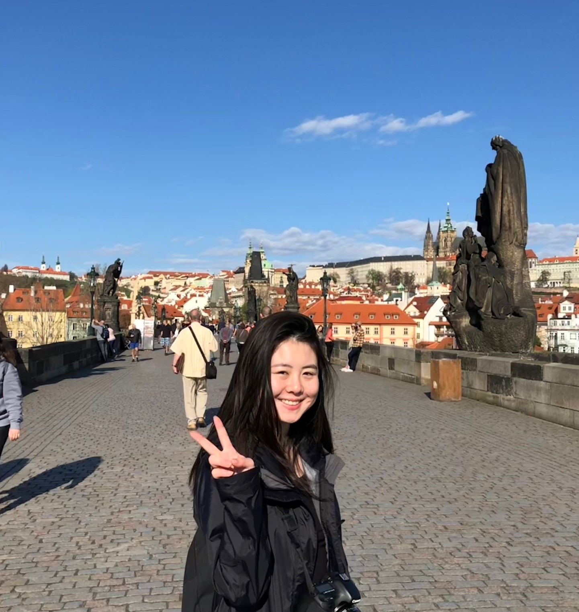

# GoGreen group 46
WIP page

## Our group
### Qingna Zheng
Name:Qingna Zheng

NetID: qingnazheng


### Momchil Bozhkov
Name: Momchil

NetId: mbozhkov


Personal Development Plan

2 Strong points:
- Determination. Having the inner courage to do everything, that needs to be done in order to achieve the goal that i have put in front of myself. Forcing myself to do the things i need to do, even when i dont feel like it, is something which makes me treat myself to a higher standard and also makes me enjoy the sweet fruit of reward much more when said goal has been achieved and achieved with high remarks.
- Good spirit and being nice in general. Being able to make a certain situation less intimidating for a single person or a group of people is very important to me so i give it my all when somebody is strugling or is in need of some sort of help. If someone is having a bad day and you make them smile for just 10 seconds that person would be gratefull to you for the rest of the day. So having the abillity to help out my teammates whether its when we are stuck on a certain problem or just make everyone smile and be motivated so that they can do their best work is something i aspire to.
 
2 Weaker points:
- Procrastination and laziness. I have been strugling with these two since i was a small child but i try my best every single day to just make them dissapear little by little so that it dosen't affect my work and the essentials of what i have to do to achieve.
- Not a lot of experience with CS in general. I am a medium pace learner of sorts and Computer Science has a lot of things that need to be inherited at a quick pace so i find myself sometimes strugling to stay a float.

My goals:

1. Experience what it's like to work in a real Software Team enviroment so that i could more easily get acquainted with the way work is done in this whole industry for later down the road.
2. Get to grip with software and programing on a more in-depth scale and see what areas of my CS skills i need to work on so that i can contribute more effectively to my team now and later on when working for an actual Software company.


### Stephen
Name:Stephen van der Kruk

NetID: svanderkruk


Personal Development Plan

2 Strong points:
- Perseverance. I don’t like when I dash off my work. So really try my hardest to know as much as I can. This is because I think that you need a good foundation of previous material before you start branching off into material which depends on that knowledge. This point is shown in the team in that I really try to finish my part of the work. I think peer pressure is a good thing in this case since I don’t want to let my team down by giving up on my work.
- Organized. I want a clear definition of what I’m doing before I start. This way I reduce the chance of digression from what must be done. In the team I think this help with knowing what we are all up to instead of digressing too much.

2 Weaker points
- Time Management. Trying to work out all the details takes a lot of time and taking the time to sort all the work doesn’t help either. I think in a group this isn’t really a problem since I really get that extra bit of motivation from working with a team to do the work immediately.
- Control freak. I don’t like it when I don’t know what something (or somebody) is doing. This sounds bad, but from previous experience from working in teams I have learned from my mistakes. Everybody knows what they are doing, so why do I feel the need to take over? That is what I ask myself. So, I’ll try to use the good parts of being a control freak, that is, being in control of what I’m doing instead of someone else is doing.

Quality 1: Perseverance -> Pitfall: Bad time management -> Challenge: Prioritize your work -> Allergy: Dashing off

Quality 2: Organized -> Pitfall: Control Freak -> Challenge: Focus only on my work -> Allergy: Disorganized

My goals
1. I want to extend my knowledge on programming. This is of obviously important since there is a lot to learn. I achieved this, when I have a good understanding of how all parts of our program work in coherence with each other. To achieve this, I will be learning through collaboration with my team, documentation and other learning material. I hope to learn from mistakes. I think testing is an important tool to understand your mistakes. I think the best thing to do now is to design and program the things that are on the planning and keep doing that throughout the project.
2. This is the more important goal in my opinion. I want to gain more experience on working in a team and learn how to be a meaningful addition to the team. This is very important to me since (software) engineering is nowadays all about collaborating. I achieved this when I have reflected and learned from the feedback of my team. So, this depends on what my team will think of my actions during the project. Whether good or bad, I hope to learn from it to do even better next time. To actively be working on learning from my actions I can ask my teammates for their opinions and feedback. That can be done by e.g. asking about the usefulness of my action.


### Mirijam
Name:Mirijam Zhang

NetID:sxzhang

Picture: 

Personal Development Plan

Two of my strong points:
- Commitment, I work seriously on my tasks and always try my best.
- Supportive, I'm always willing to help my teammates with their tasks or explain things they don't understand to them.

Two of my weaker points:
- Lazy, I am quite lazy, so I usually prefer people telling me what to do (preferably the easy tasks). In a team I usually do what I am told to do without thinking about it. This ends up in me not understanding my tasks and not doing a good job.
- Perfectionist, when I do get what's going on I feel like I need to make everything look perfect and that can lead to me pushing my way of doing it onto other people. 

Core quadrants:

Commitment -> pitfall: bad time management -> challenge: don't focus too much on one thing -> allergy: slacking off

Supportive -> pitfall: annoying -> challenge: don't do more than you've been asked to -> allergy: nonchalant

My goals:
1. I want to know how to work together on a project. This is important to me since I know that in the future, building anything will be done in a team, so it's important to learn how to work together without conflict. I will listen to the thoughts of my teammates, help them if they need help, let them help me if I need help and try to actively think of ways to improve our program and myself.
2. I want to know more about programming. This is obviously important since I study CSE. I want to know more about the different aspects of the code that builds the program, like the database and the UI. I will do this by understanding what my teammates coded and not work on one thing.

### Tim
Name: Tim

NetID: tpdanema 


### Daniela
Name: Daniela

NetID: dtoader


### Shah Farooq
Name: Shah Farooq

NetID: sfarooq


## How To Use

To clone and run this application, you'll need [Git](https://git-scm.com), [Maven](https://maven.apache.org/install.html) and [Java](https://www.oracle.com/technetwork/java/javase/downloads/index.html) installed on your computer. From your command line:

```bash
# Clone this repository
$ git clone https://gitlab.ewi.tudelft.nl/cse1105/2018-2019/oopp-group-46/template.git

# Build project
$ mvn clean install

# Run the server
$ java server/target/Server.jar

# Run the client
$ java client/target/Client.jar
```

