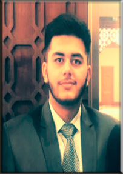

# GoGreen group 46
WIP page

## Our group
### Qingna Zheng
Name:Qingna Zheng

NetID: qingnazheng


### Momchil Bozhkov
Name: Momchil

NetId: mbozhkov


### Stephen
Name:Stephen van der Kruk

NetID: svanderkruk


Personal Development Plan

2 Strong points:
- Perseverance. I don’t like when I dash off my work. So really try my hardest to know as much as I can. This is because I think that you need a good foundation of previous material before you start branching off into material which depends on that knowledge. This point is shown in the team in that I really try to finish my part of the work. I think peer pressure is a good thing in this case since I don’t want to let my team down by giving up on my work.
- Organized. I want a clear definition of what I’m doing before I start. This way I reduce the chance of digression from what must be done. In the team I think this help with knowing what we are all up to instead of digressing too much.

2 Weaker points
- Time Management. Trying to work out all the details takes a lot of time and taking the time to sort all the work doesn’t help either. I think in a group this isn’t really a problem since I really get that extra bit of motivation from working with a team to do the work immediately.
- Control freak. I don’t like it when I don’t know what something (or somebody) is doing. This sounds bad, but from previous experience from working in teams I have learned from my mistakes. Everybody knows what they are doing, so why do I feel the need to take over? That is what I ask myself. So, I’ll try to use the good parts of being a control freak, that is, being in control of what I’m doing instead of someone else is doing.

My goals
1. I want to extend my knowledge on programming. This is of obviously important since there is a lot to learn. I achieved this, when I have a good understanding of how all parts of our program work in coherence with each other. To achieve this, I will be learning through collaboration with my team, documentation and other learning material. I hope to learn from mistakes. I think testing is an important tool to understand your mistakes. I think the best thing to do now is to design and program the things that are on the planning and keep doing that throughout the project.
2. This is the more important goal in my opinion. I want to gain more experience on working in a team and learn how to be a meaningful addition to the team. This is very important to me since (software) engineering is nowadays all about collaborating. I achieved this when I have reflected and learned from the feedback of my team. So, this depends on what my team will think of my actions during the project. Whether good or bad, I hope to learn from it to do even better next time. To actively be working on learning from my actions I can ask my teammates for their opinions and feedback. That can be done by e.g. asking about the usefulness of my action.


### Mirijam
Name:Mirijam Zhang

NetID:sxzhang

Picture: 

### Tim
Name: Tim

NetID: tpdanema 


### Daniela
Name: Daniela

NetID: dtoader


### Shah Farooq
Name: Shah Farooq

NetID: sfarooq




## How To Use

To clone and run this application, you'll need [Git](https://git-scm.com), [Maven](https://maven.apache.org/install.html) and [Java](https://www.oracle.com/technetwork/java/javase/downloads/index.html) installed on your computer. From your command line:

```bash
# Clone this repository
$ git clone https://gitlab.ewi.tudelft.nl/cse1105/2018-2019/oopp-group-46/template.git

# Build project
$ mvn clean install

# Run the server
$ java server/target/Server.jar

# Run the client
$ java client/target/Client.jar
```

